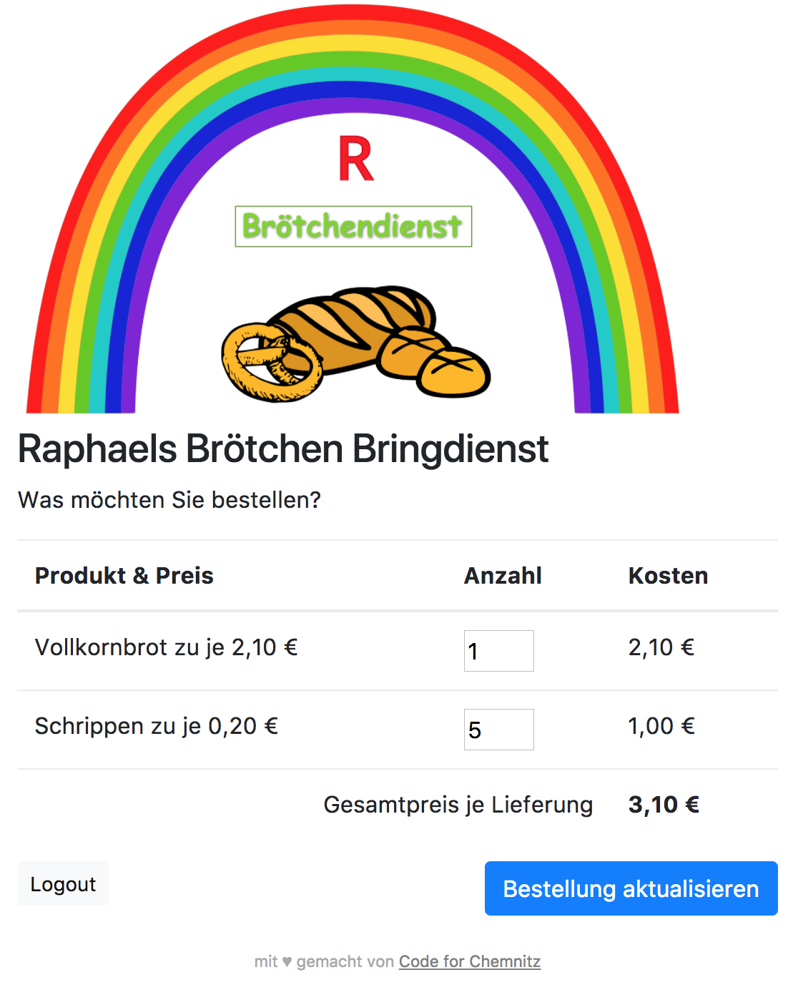

# Raphaels Brötchendienst

Ein kleiner Junge holt Sonntags für die Nachbarn gleich mit Brötchen und verdient sich was dazu.
Nur hat er keine Lust, Donnerstags nochmal rum zu gehen um die Bestellungen aufzunehmen. 
Das soll künftig die werte Kundschaft doch per App gern selbst machen.

Dies ist eine simple (quasi Vorab-) Version der **Brötchen-Bringdienste-App** zu [ChemnitzHackt/broetchen](https://github.com/ChemnitzHackt/broetchen)

*Screenshot .. so schaut sie aus*

 

### Setup

- `composer install` für u.a. Slim Framework, SwiftMailer
- `cp config.php.dist config.php` und darin u.a. Mail-Server einstellen
- `cp db/services.json.dist db/services.json` und dort die Produkte einrichten.
- `cp db/users.json.dist db/users.json` und dort die Nutzer einrichten. 
    Ja die kennt man persönlich, daher einfach was festlegen und denen mitteilen.
- `php -S localhost:3000` oder richtig hosten, z.B. auf einen Raspi :)

### Frontend

- Styling mit Bootstrap 4
- Feenstaub mit jQuery (old but gold)

### API

- **Login:** `POST /api/login` mit z.B. `{"email_address":"bla@foo.bar", "password":"xxx"}`
  - Test: `curl -i -H "Accept: application/json" -H "Content-Type: application/json" -X POST -d "{\"email_address\":\"bla@foo.bar\", \"password\":\"xxx\"}" http://localhost:3000/api/login`
- **Services & Produkte lesen:**: `GET /api/services`
  - Test: `curl http://localhost:3000/api/services`
- **Bestellung lesen:** `GET /api/orders/[sessionid]`
  - Test: `curl http://localhost:3000/api/orders/4406a33260d8956e2d95fae136a5ea74`
- **Bestellung abschicken/aktualisieren:** `POST /api/orders`
  - Test: `curl -i -H "Accept: application/json" -H "Content-Type: application/json" -X POST -d "{\"sessionid\":\"4406a33260d8956e2d95fae136a5ea74\", \"orders\": {\"broetchen\":{\"schrippe\":3,\"vollkornbrot\":1}}}" http://localhost:3000/api/orders`

### Lizenz

MIT, do what you want
